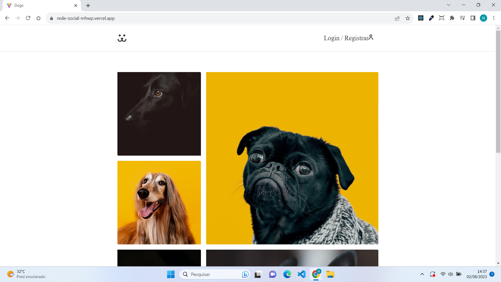

# Rede Social para Cachorro




> Projeto desenvolvido após a conclusão do curso de React-JS do Origamid. O projeto tem o intuito desenvolver uma rede social para cachorros como forma de
> praticar os conhecimentos adquiridos durante o curso.

### Ajustes e melhorias

O projeto ainda está em desenvolvimento e as próximas atualizações serão voltadas nas seguintes tarefas:

- [x] Otimização dos gráficos
- [x] Sistema Responsivo
- [ ] Implementar a função de "Esqueceu a senha"


## 💻 Pré-requisitos

Antes de começar, verifique se você atendeu aos seguintes requisitos:

* Você instalou a versão 18.3 do node usada nesse projeto
* Você tem uma máquina `<Windows / Linux / Mac>`. 

## 🚀 Instalando rede-scoal

Para instalar o projeto <rede-social>, siga estas etapas:

Linux e macOS:
* abra o projeto no vscode
* execute os comandos no terminal
```
npm install
npm run dev
```

Windows:
* abra o projeto no vscode
* execute os comandos no terminal
```
npm install
npm run dev
```

## 🔧Tecnologias utilizadas
* [React](https://vitejs.dev/guide/) - Uma biblioteca JS para desenvolvimento de sites.
* [ContextAPI](https://reactjs.org/docs/context.html) - permite gerenciar estados globais de aplicativos
* [React-Router-Dom](https://reactrouter.com/en/main) - bbiblioteca usada resolver problemas de rotas para as páginas de um site e tornar o desenvolvimento muito mais simples e escalável
* [Styled-Components](https://styled-components.com/) - biblioteca para estilização de sites com CSS
* [Victory](https://formidable.com/open-source/victory/) - bibliota para geração de componentes com gráficos
* [Axios](https://axios-http.com/ptbr/docs/intro) - biblioteca usada para consumir API (além dela, utilizou-se fetch)


# ✒️Autor

⌨️ com ❤️ por [Nando Gabriel](https://github.com/engnandogabriel/) 😊
